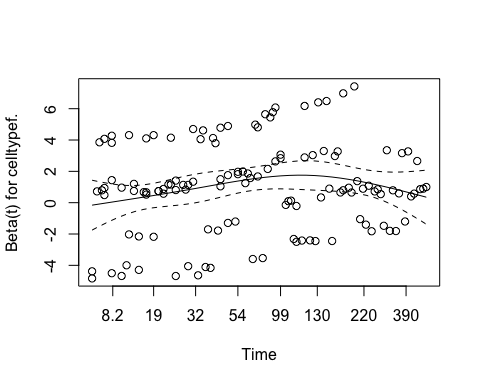

Exercise: Veteran Data
================
Jooyoung Lee
3/15/2023

- [1. The Kaplan-Meier estimator](#1-the-kaplan-meier-estimator)
- [2. Log-rank test](#2-log-rank-test)
- [3. Cox Proportional Hazard Regression
  Model](#3-cox-proportional-hazard-regression-model)
  - [Estimation](#estimation)
  - [Model diagnostics](#model-diagnostics)
  - [Stratification](#stratification)
  - [Time-dependent Covariate](#time-dependent-covariate)

A study was conducted to compare the effects of two chemotherapy
treatments in survival times for lung cancer patients. A total of 137
patients were randomly assigned to one of standard or test treatment
group. The data include a number of covariates including tumor cell
types, a Karnofsky performance score, the age of patient and time in
months from diagnosis to randomization.

``` r
library(survival)
attach(veteran)
?veteran
head(veteran)
```

    ##   trt celltype time status karno diagtime age prior
    ## 1   1 squamous   72      1    60        7  69     0
    ## 2   1 squamous  411      1    70        5  64    10
    ## 3   1 squamous  228      1    60        3  38     0
    ## 4   1 squamous  126      1    60        9  63    10
    ## 5   1 squamous  118      1    70       11  65    10
    ## 6   1 squamous   10      1    20        5  49     0

# 1. The Kaplan-Meier estimator

Now we calculate the Kaplan-Meier estimates of the survival function for
each group using the `survfit` function in `library(survival)`.

`survfit` uses the Greenwood’s formula for the variance calculation by
default, which is
$$Var(\widehat{S}(t)) = \widehat{S}(t)^2 \sum\limits_{j:t_j \leq t} \frac{d_j}{n_j(n_j-d_j)},$$
where
$$\widehat{S}(t) = \prod\limits_{j:t_j \leq t}\left(1-\frac{d_j}{n_j}\right).$$

### Confidence limits for $S(t)$

Here we consider $100(1-\alpha)\%$ pointwise confidence intervals for
$S(t)$ for a particular specified time $t$.

`survfit` has several options for types of confidence intervals.

- conf.type=“plain”
  $$\widehat{S}(t) \pm z_{1-\alpha/2}\hspace{1mm} se(\widehat{S}(t))$$

- conf.type=“log” (default)
  $$\widehat{S}(t) \exp(\pm z_{1-\alpha/2} \hspace{1mm} se(\log\widehat{S}(t)),$$
  where
  $$Var(\log \widehat{S}(t)) =\sum_{j:t_j\leq t} \frac{d_j}{n_j(n_j-d_j)}.$$

- conf.type=“log-log”
  $$\{\widehat{S}(t)\}^{\exp[\pm z_{1-\alpha/2} \hspace{1mm} se(\log[-\log\{\widehat{S}(t)\}])]},$$
  where

$$Var[\log \{-\log\widehat{S}(t)\}] =\frac{1}{\{ \log \widehat{S}(t)\}^2} \sum_{j:t_j \leq t}\frac{d_j}{n_j(n_j-d_j)}.$$

``` r
library(survival)
library(knitr)

# Kaplan-Meier curve for standard treatment 
fit0.km <- survfit(Surv(time, status) ~ 1, data=veteran, subset=(trt==1))  
summary(fit0.km)
```

    ## Call: survfit(formula = Surv(time, status) ~ 1, data = veteran, subset = (trt == 
    ##     1))
    ## 
    ##  time n.risk n.event survival std.err lower 95% CI upper 95% CI
    ##     3     69       1   0.9855  0.0144      0.95771        1.000
    ##     4     68       1   0.9710  0.0202      0.93223        1.000
    ##     7     67       1   0.9565  0.0246      0.90959        1.000
    ##     8     66       2   0.9275  0.0312      0.86834        0.991
    ##    10     64       2   0.8986  0.0363      0.83006        0.973
    ##    11     62       1   0.8841  0.0385      0.81165        0.963
    ##    12     61       2   0.8551  0.0424      0.77592        0.942
    ##    13     59       1   0.8406  0.0441      0.75849        0.932
    ##    16     58       1   0.8261  0.0456      0.74132        0.921
    ##    18     57       2   0.7971  0.0484      0.70764        0.898
    ##    20     55       1   0.7826  0.0497      0.69109        0.886
    ##    21     54       1   0.7681  0.0508      0.67472        0.874
    ##    22     53       1   0.7536  0.0519      0.65851        0.862
    ##    27     51       1   0.7388  0.0529      0.64208        0.850
    ##    30     50       1   0.7241  0.0539      0.62580        0.838
    ##    31     49       1   0.7093  0.0548      0.60967        0.825
    ##    35     48       1   0.6945  0.0556      0.59368        0.812
    ##    42     47       1   0.6797  0.0563      0.57782        0.800
    ##    51     46       1   0.6650  0.0570      0.56209        0.787
    ##    52     45       1   0.6502  0.0576      0.54649        0.774
    ##    54     44       2   0.6206  0.0587      0.51565        0.747
    ##    56     42       1   0.6059  0.0591      0.50040        0.734
    ##    59     41       1   0.5911  0.0595      0.48526        0.720
    ##    63     40       1   0.5763  0.0598      0.47023        0.706
    ##    72     39       1   0.5615  0.0601      0.45530        0.693
    ##    82     38       1   0.5467  0.0603      0.44049        0.679
    ##    92     37       1   0.5320  0.0604      0.42577        0.665
    ##    95     36       1   0.5172  0.0605      0.41116        0.651
    ##   100     34       1   0.5020  0.0606      0.39615        0.636
    ##   103     32       1   0.4863  0.0607      0.38070        0.621
    ##   105     31       1   0.4706  0.0608      0.36537        0.606
    ##   110     30       1   0.4549  0.0607      0.35018        0.591
    ##   117     29       2   0.4235  0.0605      0.32017        0.560
    ##   118     27       1   0.4079  0.0602      0.30537        0.545
    ##   122     26       1   0.3922  0.0599      0.29069        0.529
    ##   126     24       1   0.3758  0.0596      0.27542        0.513
    ##   132     23       1   0.3595  0.0592      0.26031        0.496
    ##   139     22       1   0.3432  0.0587      0.24535        0.480
    ##   143     21       1   0.3268  0.0582      0.23057        0.463
    ##   144     20       1   0.3105  0.0575      0.21595        0.446
    ##   151     19       1   0.2941  0.0568      0.20151        0.429
    ##   153     18       1   0.2778  0.0559      0.18725        0.412
    ##   156     17       1   0.2614  0.0550      0.17317        0.395
    ##   162     16       2   0.2288  0.0527      0.14563        0.359
    ##   177     14       1   0.2124  0.0514      0.13218        0.341
    ##   200     12       1   0.1947  0.0501      0.11761        0.322
    ##   216     11       1   0.1770  0.0486      0.10340        0.303
    ##   228     10       1   0.1593  0.0468      0.08956        0.283
    ##   250      9       1   0.1416  0.0448      0.07614        0.263
    ##   260      8       1   0.1239  0.0426      0.06318        0.243
    ##   278      7       1   0.1062  0.0400      0.05076        0.222
    ##   287      6       1   0.0885  0.0371      0.03896        0.201
    ##   314      5       1   0.0708  0.0336      0.02793        0.180
    ##   384      4       1   0.0531  0.0295      0.01788        0.158
    ##   392      3       1   0.0354  0.0244      0.00917        0.137
    ##   411      2       1   0.0177  0.0175      0.00256        0.123
    ##   553      1       1   0.0000     NaN           NA           NA

``` r
fit0.km$surv   # est of S(t)
```

    ##  [1] 0.98550725 0.97101449 0.95652174 0.92753623 0.89855072 0.88405797
    ##  [7] 0.85507246 0.84057971 0.82608696 0.79710145 0.78260870 0.76811594
    ## [13] 0.75362319 0.75362319 0.73884626 0.72406934 0.70929241 0.69451549
    ## [19] 0.67973856 0.66496164 0.65018471 0.62063086 0.60585394 0.59107701
    ## [25] 0.57630009 0.56152316 0.54674623 0.53196931 0.51719238 0.51719238
    ## [31] 0.50198084 0.48629394 0.47060704 0.45492014 0.42354634 0.40785944
    ## [37] 0.39217253 0.39217253 0.37583201 0.35949149 0.34315097 0.32681044
    ## [43] 0.31046992 0.29412940 0.27778888 0.26144836 0.22876731 0.21242679
    ## [49] 0.21242679 0.19472456 0.17702232 0.15932009 0.14161786 0.12391563
    ## [55] 0.10621339 0.08851116 0.07080893 0.05310670 0.03540446 0.01770223
    ## [61] 0.00000000

``` r
fit0.km$std.err  # se of H(t) or -log(S(t))
```

    ##  [1] 0.01459893 0.02079951 0.02566635 0.03364887 0.04045094 0.04359689
    ##  [7] 0.04956207 0.05242734 0.05523682 0.06073767 0.06344892 0.06614507
    ## [13] 0.06883324 0.06883324 0.07162522 0.07442000 0.07722374 0.08004229
    ## [19] 0.08288126 0.08574611 0.08864223 0.09454997 0.09757262 0.10064876
    ## [25] 0.10378438 0.10698580 0.11025969 0.11361316 0.11705384 0.11705384
    ## [31] 0.12080094 0.12490369 0.12913636 0.13351264 0.14275820 0.14766315
    ## [37] 0.15278373 0.15278373 0.15860158 0.16471413 0.17115855 0.17797809
    ## [43] 0.18522359 0.19295532 0.20124545 0.21018135 0.23044473 0.24207288
    ## [49] 0.24207288 0.25724509 0.27434639 0.29389974 0.31664798 0.34369039
    ## [55] 0.37673945 0.41864776 0.47462190 0.55551713 0.68939535 0.98755554
    ## [61]        Inf

``` r
fit0.km$lower # lower 95% CI for S(t)
```

    ##  [1] 0.957708167 0.932225845 0.909594044 0.868338214 0.830062311 0.811654129
    ##  [7] 0.775917611 0.758494913 0.741324068 0.707641998 0.691093573 0.674720630
    ## [13] 0.658511386 0.658511386 0.642076214 0.625797382 0.609666523 0.593676439
    ## [19] 0.577820910 0.562094548 0.546492680 0.515646755 0.500396160 0.485256867
    ## [25] 0.470226669 0.455303714 0.440486479 0.425773747 0.411164597 0.411164597
    ## [31] 0.396151404 0.380698046 0.365373756 0.350178113 0.320173165 0.305365110
    ## [37] 0.290688219 0.290688219 0.275417708 0.260305707 0.245354942 0.230568888
    ## [43] 0.215951849 0.201509057 0.187246807 0.173172619 0.145626048 0.132177179
    ## [49] 0.132177179 0.117612453 0.103396054 0.089557640 0.076135425 0.063179515
    ## [55] 0.050757251 0.038962286 0.027931171 0.017876902 0.009167347 0.002555167
    ## [61]          NA

``` r
fit0.km$upper # upper 95% CI for S(t)
```

    ##  [1] 1.0000000 1.0000000 1.0000000 0.9907700 0.9726901 0.9629206 0.9423023
    ##  [8] 0.9315478 0.9205416 0.8978703 0.8862423 0.8744391 0.8624724 0.8624724
    ## [15] 0.8502009 0.8377734 0.8251982 0.8124826 0.7996327 0.7866541 0.7735514
    ## [22] 0.7469894 0.7335368 0.7199734 0.7063015 0.6925229 0.6786393 0.6646519
    ## [29] 0.6505618 0.6505618 0.6360820 0.6211794 0.6061491 0.5909916 0.5602952
    ## [36] 0.5447555 0.5290868 0.5290868 0.5128563 0.4964706 0.4799275 0.4632241
    ## [43] 0.4463568 0.4293212 0.4121120 0.3947232 0.3593758 0.3413989 0.3413989
    ## [50] 0.3223949 0.3030764 0.2834252 0.2634203 0.2430389 0.2222596 0.2010720
    ## [57] 0.1795093 0.1577634 0.1367327 0.1226413        NA

``` r
# Kaplan-Meier curve for test treatment 
fit1.km <- survfit(Surv(time, status) ~ 1, data=veteran, subset=(trt==2))  
summary(fit1.km)
```

    ## Call: survfit(formula = Surv(time, status) ~ 1, data = veteran, subset = (trt == 
    ##     2))
    ## 
    ##  time n.risk n.event survival std.err lower 95% CI upper 95% CI
    ##     1     68       2   0.9706  0.0205      0.93125        1.000
    ##     2     66       1   0.9559  0.0249      0.90830        1.000
    ##     7     65       2   0.9265  0.0317      0.86647        0.991
    ##     8     63       2   0.8971  0.0369      0.82766        0.972
    ##    13     61       1   0.8824  0.0391      0.80900        0.962
    ##    15     60       2   0.8529  0.0429      0.77278        0.941
    ##    18     58       1   0.8382  0.0447      0.75513        0.930
    ##    19     57       2   0.8088  0.0477      0.72056        0.908
    ##    20     55       1   0.7941  0.0490      0.70360        0.896
    ##    21     54       1   0.7794  0.0503      0.68684        0.884
    ##    24     53       2   0.7500  0.0525      0.65383        0.860
    ##    25     51       3   0.7059  0.0553      0.60548        0.823
    ##    29     48       1   0.6912  0.0560      0.58964        0.810
    ##    30     47       1   0.6765  0.0567      0.57394        0.797
    ##    31     46       1   0.6618  0.0574      0.55835        0.784
    ##    33     45       1   0.6471  0.0580      0.54289        0.771
    ##    36     44       1   0.6324  0.0585      0.52754        0.758
    ##    43     43       1   0.6176  0.0589      0.51230        0.745
    ##    44     42       1   0.6029  0.0593      0.49717        0.731
    ##    45     41       1   0.5882  0.0597      0.48216        0.718
    ##    48     40       1   0.5735  0.0600      0.46724        0.704
    ##    49     39       1   0.5588  0.0602      0.45244        0.690
    ##    51     38       2   0.5294  0.0605      0.42313        0.662
    ##    52     36       2   0.5000  0.0606      0.39423        0.634
    ##    53     34       1   0.4853  0.0606      0.37993        0.620
    ##    61     33       1   0.4706  0.0605      0.36573        0.606
    ##    73     32       1   0.4559  0.0604      0.35163        0.591
    ##    80     31       2   0.4265  0.0600      0.32373        0.562
    ##    84     28       1   0.4112  0.0597      0.30935        0.547
    ##    87     27       1   0.3960  0.0594      0.29509        0.531
    ##    90     25       1   0.3802  0.0591      0.28028        0.516
    ##    95     24       1   0.3643  0.0587      0.26560        0.500
    ##    99     23       2   0.3326  0.0578      0.23670        0.467
    ##   111     20       2   0.2994  0.0566      0.20673        0.434
    ##   112     18       1   0.2827  0.0558      0.19203        0.416
    ##   133     17       1   0.2661  0.0550      0.17754        0.399
    ##   140     16       1   0.2495  0.0540      0.16326        0.381
    ##   164     15       1   0.2329  0.0529      0.14920        0.363
    ##   186     14       1   0.2162  0.0517      0.13538        0.345
    ##   201     13       1   0.1996  0.0503      0.12181        0.327
    ##   231     12       1   0.1830  0.0488      0.10851        0.308
    ##   242     10       1   0.1647  0.0472      0.09389        0.289
    ##   283      9       1   0.1464  0.0454      0.07973        0.269
    ##   340      8       1   0.1281  0.0432      0.06609        0.248
    ##   357      7       1   0.1098  0.0407      0.05304        0.227
    ##   378      6       1   0.0915  0.0378      0.04067        0.206
    ##   389      5       1   0.0732  0.0344      0.02912        0.184
    ##   467      4       1   0.0549  0.0303      0.01861        0.162
    ##   587      3       1   0.0366  0.0251      0.00953        0.140
    ##   991      2       1   0.0183  0.0180      0.00265        0.126
    ##   999      1       1   0.0000     NaN           NA           NA

``` r
fit1.km$surv   # est of S(t)
```

    ##  [1] 0.97058824 0.95588235 0.92647059 0.89705882 0.88235294 0.85294118
    ##  [7] 0.83823529 0.80882353 0.79411765 0.77941176 0.75000000 0.70588235
    ## [13] 0.69117647 0.67647059 0.66176471 0.64705882 0.63235294 0.61764706
    ## [19] 0.60294118 0.58823529 0.57352941 0.55882353 0.52941176 0.50000000
    ## [25] 0.48529412 0.47058824 0.45588235 0.42647059 0.42647059 0.41123950
    ## [31] 0.39600840 0.38016807 0.36432773 0.33264706 0.33264706 0.29938235
    ## [37] 0.28275000 0.26611765 0.24948529 0.23285294 0.21622059 0.19958824
    ## [43] 0.18295588 0.16466029 0.14636471 0.12806912 0.10977353 0.09147794
    ## [49] 0.07318235 0.05488676 0.03659118 0.01829559 0.00000000

``` r
fit1.km$std.err  # se of H(t) or -log(S(t))
```

    ##  [1] 0.02111002 0.02605251 0.03416334 0.04107993 0.04428074 0.05035372
    ##  [7] 0.05327267 0.05895707 0.06174655 0.06451389 0.07001400 0.07827804
    ## [13] 0.08105994 0.08386446 0.08669683 0.08956222 0.09246584 0.09541300
    ## [19] 0.09840915 0.10145993 0.10457124 0.10774928 0.11433239 0.12126781
    ## [25] 0.12488854 0.12862394 0.13248465 0.14063028 0.14063028 0.14525711
    ## [31] 0.15008041 0.15553391 0.16125257 0.17361790 0.17361790 0.18894108
    ## [37] 0.19739986 0.20650224 0.21635583 0.22709414 0.23888544 0.25194545
    ## [43] 0.26655631 0.28664155 0.30992300 0.33750468 0.37110502 0.41358466
    ## [49] 0.47016196 0.55171152 0.68633248 0.98541984        Inf

``` r
fit1.km$lower # lower 95% CI for S(t)
```

    ##  [1] 0.931249696 0.908298321 0.866466452 0.827663163 0.809003685 0.772783638
    ##  [7] 0.755127288 0.720558806 0.703600421 0.686835340 0.653830589 0.605482979
    ## [13] 0.589644975 0.573935858 0.558350781 0.542885532 0.527536456 0.512300383
    ## [19] 0.497174586 0.482156725 0.467244822 0.452437226 0.423129867 0.394227263
    ## [25] 0.379926606 0.365726282 0.351626537 0.323731062 0.323731062 0.309351156
    ## [31] 0.295090839 0.280275370 0.265603502 0.236700873 0.236700873 0.206727978
    ## [37] 0.192032858 0.177540994 0.163261032 0.149203443 0.135380898 0.121808777
    ## [43] 0.108505870 0.093885637 0.079731407 0.066093677 0.053041093 0.040669842
    ## [49] 0.029120832 0.018614438 0.009531672 0.002651890          NA

``` r
fit1.km$upper # upper 95% CI for S(t)
```

    ##  [1] 1.0000000 1.0000000 0.9906301 0.9722730 0.9623525 0.9414131 0.9304900
    ##  [8] 0.9079002 0.8962798 0.8844663 0.8603146 0.8229296 0.8101908 0.7973233
    ## [15] 0.7843323 0.7712217 0.7579955 0.7446567 0.7312081 0.7176520 0.7039907
    ## [22] 0.6902256 0.6623896 0.6341520 0.6198839 0.6055165 0.5910496 0.5618156
    ## [29] 0.5618156 0.5466859 0.5314386 0.5156634 0.4997475 0.4674848 0.4674848
    ## [36] 0.4335639 0.4163223 0.3988859 0.3812478 0.3633997 0.3453319 0.3270328
    ## [43] 0.3084889 0.2887877 0.2686849 0.2481584 0.2271866 0.2057597 0.1839115
    ## [50] 0.1618398 0.1404700 0.1262226        NA

``` r
par(mfrow=c(1,2))
plot(fit0.km, xlab="TIME(DAYS) SINCE RANDOMIZATION", 
     ylab="ESTIMATED  PROBABILITY  OF  SURVIVAL", cex.lab=.7, cex.axis=0.5)
mtext("STANDARD TREATMENT", side=3, line=0.5,  cex=.8)
plot(fit1.km, xlab="TIME(DAYS) SINCE RANDOMIZATION", 
     ylab="ESTIMATED  PROBABILITY  OF  SURVIVAL", cex.lab=.7, cex.axis=0.5)
mtext("TEST TREATMENT", side=3, line=0.5,  cex=.8)
```

<!-- -->

``` r
library(ggsurvfit)
```

    ## Loading required package: ggplot2

``` r
library(ggplot2)
library(ggsci)

veteran$trt2 <- factor(veteran$trt, 1:2, c("Standard", "Test"))

p1 <- survfit2(Surv(time, status) ~ trt2, data = veteran) %>%
  ggsurvfit(type="survival",
    theme = theme_classic() +
             theme(legend.position = "top") +
             theme(panel.grid.major.y = element_line(color = "gray90"))) +
  scale_x_continuous(breaks=c(0, 200, 400, 600, 800, 1000), expand=c(0,0))+
  scale_y_continuous(limits=c(0, 1), expand=c(0,0)) +
  labs(x = "TIME(DAYS) SINCE RANDOMIZATION", y = "SURVIVAL PROBABILITY",
       title = "MORTALITY") +
  theme(axis.title.y = element_text(vjust = -0.1),
        axis.title.x = element_text(vjust = -0.1),
        plot.title = element_text(hjust = -0.08, vjust=-3, size=10))+
  scale_color_jama()+
  add_risktable(times = c(0, 200, 400, 600, 800, 1000),
                risktable_stats = c("n.risk"),
                risktable_group = c("risktable_stats"),
                risktable_height = 0.2, # Adjusts the height of the risk table (default is 0.25),
                stats_label = "No. at risk",
                size =3, hjust= 0) 
   
p1
```

<!-- -->

### Median Survival Time

Suppose we construct the confidence limit of $S(t)$ based on the
log-transformation. From the graphical method, the median survival time
for the standard treatment group is 103 days and the corresponding 95%
confidence intervals are (59, 132). In addition, the median survival
time for the test treatment group is 52 days and the corresponding 95%
confidence intervals are (44, 95).

``` r
par(mfrow=c(1,2))
plot(fit0.km, xlab="TIME(DAYS) SINCE RANDOMIZATION", 
     ylab="ESTIMATED  PROBABILITY  OF  SURVIVAL", cex.lab=0.7, cex.axis=0.5)
abline(h=0.5, lty=3, lwd=2, col="red")
mtext("STANDARD TREATMENT", side=3, line=0.5,  cex=.8) 

plot(fit1.km, xlab="TIME(DAYS) SINCE RANDOMIZATION", 
     ylab="ESTIMATED  PROBABILITY  OF  SURVIVAL", cex.lab=0.7, cex.axis=0.5)
abline(h=0.5, lty=3, lwd=2, col="red")
mtext("TEST TREATMENT", side=3, line=0.5,  cex=.8)
```


# 2. Log-rank test

Now, we want to test $H_0: S_1(t) = S_2(t)$ for all $t$.

``` r
library(KMsurv)
survdiff(Surv(time, status)~factor(trt), data = veteran)
```

    ## Call:
    ## survdiff(formula = Surv(time, status) ~ factor(trt), data = veteran)
    ## 
    ##                N Observed Expected (O-E)^2/E (O-E)^2/V
    ## factor(trt)=1 69       64     64.5   0.00388   0.00823
    ## factor(trt)=2 68       64     63.5   0.00394   0.00823
    ## 
    ##  Chisq= 0  on 1 degrees of freedom, p= 0.9

``` r
1-pchisq(0.00823, 1)
```

    ## [1] 0.9277156

The test statistic is
$$ \frac{(O-E)^2}{V} \sim \chi_{1}^2 \quad \text{under }H_0 $$ The
p-values is $P(\chi_{1}^2 > 0.00823) = 0.9277156$. Therefore we do not
reject the null hypothesis, therefore, the survival function is not
different between the standard treatment group and the test treatment
group.

# 3. Cox Proportional Hazard Regression Model

## Estimation

We fit a Cox regression model including the treatment indicator (`trt`),
cell types (`celltype`), performance status (`karno`), the months from
diagnosis of lung cancer to entry into the study (`diagtime`), prior
therapy (`prior`), and age(`age`).

``` r
library(survival)
attach(veteran)
```

    ## The following objects are masked from veteran (pos = 8):
    ## 
    ##     age, celltype, diagtime, karno, prior, status, time, trt

``` r
veteran$celltypef. <- factor(veteran$celltype, levels=c("large", "squamous", 
                                                        "smallcell", "adeno"))
fit1 <- coxph(Surv(time, status)~ factor(trt) + celltypef. + karno + diagtime 
              + factor(prior) + age , data=veteran, method="breslow")
summary(fit1)
```

    ## Call:
    ## coxph(formula = Surv(time, status) ~ factor(trt) + celltypef. + 
    ##     karno + diagtime + factor(prior) + age, data = veteran, method = "breslow")
    ## 
    ##   n= 137, number of events= 128 
    ## 
    ##                          coef exp(coef)  se(coef)      z Pr(>|z|)    
    ## factor(trt)2         0.289936  1.336342  0.207210  1.399  0.16174    
    ## celltypef.squamous  -0.399628  0.670570  0.282663 -1.414  0.15742    
    ## celltypef.smallcell  0.456859  1.579106  0.266273  1.716  0.08621 .  
    ## celltypef.adeno      0.788672  2.200471  0.302668  2.606  0.00917 ** 
    ## karno               -0.032622  0.967905  0.005505 -5.926 3.11e-09 ***
    ## diagtime            -0.000092  0.999908  0.009125 -0.010  0.99196    
    ## factor(prior)10      0.072327  1.075006  0.232133  0.312  0.75536    
    ## age                 -0.008549  0.991487  0.009304 -0.919  0.35816    
    ## ---
    ## Signif. codes:  0 '***' 0.001 '**' 0.01 '*' 0.05 '.' 0.1 ' ' 1
    ## 
    ##                     exp(coef) exp(-coef) lower .95 upper .95
    ## factor(trt)2           1.3363     0.7483    0.8903    2.0058
    ## celltypef.squamous     0.6706     1.4913    0.3853    1.1669
    ## celltypef.smallcell    1.5791     0.6333    0.9370    2.6611
    ## celltypef.adeno        2.2005     0.4544    1.2159    3.9824
    ## karno                  0.9679     1.0332    0.9575    0.9784
    ## diagtime               0.9999     1.0001    0.9822    1.0180
    ## factor(prior)10        1.0750     0.9302    0.6821    1.6943
    ## age                    0.9915     1.0086    0.9736    1.0097
    ## 
    ## Concordance= 0.736  (se = 0.021 )
    ## Likelihood ratio test= 61.41  on 8 df,   p=2e-10
    ## Wald test            = 61.65  on 8 df,   p=2e-10
    ## Score (logrank) test = 65.92  on 8 df,   p=3e-11

``` r
library(knitr)
xname <- c("Treatment", "Cell Type", "", "", "performance status", 
           "Time from Diagnosis to entry", "Prior Therapy", "Age")
compare <- c("Test vs. Standard", "Squamous vs. Large", "Small vs. Large", 
             "Adeno vs. Large", "1 unit increase", "1 month increase", 
             "Yes vs. No", "1 year increase")
res <- data.frame(xname, compare, summary(fit1)$coef[,2],  
                  paste("(", round(exp(confint(fit1))[,1], 3), ", ",
                        round(exp(confint(fit1))[,2], 3), ")", sep=""), summary(fit1)$coef[,c(4,5)])
colnames(res) <- c("Covariates", "Comparison",  "RR", "95% CI", "z", "p-value")
rownames(res) <- NULL

kable(res,
digits = c(3, 3, 3, 4))
```

| Covariates                   | Comparison         |    RR | 95% CI         |      z | p-value |
|:-----------------------------|:-------------------|------:|:---------------|-------:|--------:|
| Treatment                    | Test vs. Standard  | 1.336 | (0.89, 2.006)  |  1.399 |   0.162 |
| Cell Type                    | Squamous vs. Large | 0.671 | (0.385, 1.167) | -1.414 |   0.157 |
|                              | Small vs. Large    | 1.579 | (0.937, 2.661) |  1.716 |   0.086 |
|                              | Adeno vs. Large    | 2.200 | (1.216, 3.982) |  2.606 |   0.009 |
| performance status           | 1 unit increase    | 0.968 | (0.958, 0.978) | -5.926 |   0.000 |
| Time from Diagnosis to entry | 1 month increase   | 1.000 | (0.982, 1.018) | -0.010 |   0.992 |
| Prior Therapy                | Yes vs. No         | 1.075 | (0.682, 1.694) |  0.312 |   0.755 |
| Age                          | 1 year increase    | 0.991 | (0.974, 1.01)  | -0.919 |   0.358 |

``` r
# drop treatment
fit5 <- coxph(Surv(time, status)~  celltypef. + karno, data=veteran, method="breslow")
summary(fit5)
```

    ## Call:
    ## coxph(formula = Surv(time, status) ~ celltypef. + karno, data = veteran, 
    ##     method = "breslow")
    ## 
    ##   n= 137, number of events= 128 
    ## 
    ##                          coef exp(coef)  se(coef)      z Pr(>|z|)    
    ## celltypef.squamous  -0.325143  0.722424  0.276694 -1.175  0.23996    
    ## celltypef.smallcell  0.387005  1.472565  0.261005  1.483  0.13814    
    ## celltypef.adeno      0.825659  2.283384  0.293329  2.815  0.00488 ** 
    ## karno               -0.030904  0.969569  0.005179 -5.968 2.41e-09 ***
    ## ---
    ## Signif. codes:  0 '***' 0.001 '**' 0.01 '*' 0.05 '.' 0.1 ' ' 1
    ## 
    ##                     exp(coef) exp(-coef) lower .95 upper .95
    ## celltypef.squamous     0.7224     1.3842    0.4200    1.2426
    ## celltypef.smallcell    1.4726     0.6791    0.8829    2.4561
    ## celltypef.adeno        2.2834     0.4379    1.2850    4.0575
    ## karno                  0.9696     1.0314    0.9598    0.9795
    ## 
    ## Concordance= 0.734  (se = 0.023 )
    ## Likelihood ratio test= 58.77  on 4 df,   p=5e-12
    ## Wald test            = 60.58  on 4 df,   p=2e-12
    ## Score (logrank) test = 63.22  on 4 df,   p=6e-13

We drop non-significant variables by backward elimination, which leads
to the model including only cell type and performance status variables
with the form of

$$\lambda(t|\mathbf{z}_i) = \lambda_0(t)\exp(\mathbf{z}_i'\boldsymbol{\beta})
=\lambda_0(t)\exp(z_{i1}\beta_1 + z_{i2}\beta_2 + z_{i3}\beta_3 + z_{i4}\beta_4)$$
where
$\mathbf{z}_i = (I(\text{cell-type = Squamous}), I(\text{cell-type = Small cell}), I(\text{cell-type = Adeno cell}), \text{performance status})'$,
$\boldsymbol{\beta} = (\beta_1, \beta_2, \beta_3, \beta_4)'$.

``` r
xname <- c("Cell Type", "", "", "performance status")
compare <- c("Squamous vs. Large", "Small vs. Large", "Adeno vs. Large", "1 unit increase")
res <- data.frame(xname, compare, summary(fit5)$coef[,2], 
                  paste("(", round(exp(confint(fit5))[,1], 3), ", ", 
                  round(exp(confint(fit5))[,2], 3), ")", sep=""), summary(fit5)$coef[,c(4,5)])
colnames(res) <- c("Covariates", "Comparison",  "RR", "95% CI", "z", "p-value")
rownames(res) <- NULL

kable(res,
digits = c(3, 3, 3, 4))
```

| Covariates         | Comparison         |    RR | 95% CI         |      z | p-value |
|:-------------------|:-------------------|------:|:---------------|-------:|--------:|
| Cell Type          | Squamous vs. Large | 0.722 | (0.42, 1.243)  | -1.175 |   0.240 |
|                    | Small vs. Large    | 1.473 | (0.883, 2.456) |  1.483 |   0.138 |
|                    | Adeno vs. Large    | 2.283 | (1.285, 4.058) |  2.815 |   0.005 |
| performance status | 1 unit increase    | 0.970 | (0.96, 0.979)  | -5.968 |   0.000 |

We now plot the estimated cumulative hazard function and the survival
function. In `R`, these estimators are calculated for a hypothesis
person with the average covariates. Therefore, it is strongly
recommended to use `newdata` to specify covariate values. For example,
we are interested in estimating the cumulative hazard function and the
survival function for the individuals with squamous cell type and
performance status of 50.

``` r
# The breslow estimates
H0 <- basehaz(fit5)

# The cumulative hazard and survival function for the individual with specified covariates
mydata <- with(veteran, data.frame(celltypef.="squamous", karno=50))
H <- survfit(fit5, newdata=mydata, type="aalen")

par(mfrow=c(1,2))
plot(H, fun="cumhaz", main="Estimated Cumulative Hazard")
plot(H, main="Estimated Survival Function")
```

<!-- -->

## Model diagnostics

Here, we check the proportional hazard assumptions.

`cox.zph` function is used for checking the PH assumptions. In the
output of `cox.zph`, `chisq` gives the test statistics with `df`,
degrees of freedom and `p` gives the p-value. The last row of `GLOBAL`
gives the global test of proportional hazards over all p Covariates.

``` r
zph.fit5 <- cox.zph(fit5)

zph.fit5
```

    ##            chisq df       p
    ## celltypef.  13.9  3 0.00305
    ## karno       14.1  1 0.00017
    ## GLOBAL      23.3  4 0.00011

``` r
plot(zph.fit5[1])
```

<!-- -->

``` r
plot(zph.fit5[2])
```

<!-- -->

There is some evidence for nonproportionality for the cell types and
performance status, which are the significant predictor in the Cox
model. In particular, the left penal of Figure 4 shows that the upward
trend ends around 100 days for the scaled Schoenfeld residual plot of
the performance status, which identifies 100 days as a point to allow
the hazard ratio to change.

## Stratification

To remove the problem of non-proportionality, first we use a cell-type
variable as a stratifying variable. Then, a new model has the form of
which allows the cell-type specific baseline hazard functions.

`strata` is used to specify a stratifying variable in `coxph`.

``` r
fit5.str <- coxph(Surv(time, status) ~ karno + strata(celltypef.), data=veteran, method="breslow")
km <- survfit(fit5.str)
km
```

    ## Call: survfit(formula = fit5.str)
    ## 
    ##            n events median 0.95LCL 0.95UCL
    ## large     27     26    111     100     200
    ## squamous  35     31    118      82     283
    ## smallcell 48     45     54      30      95
    ## adeno     27     26     52      36      92

``` r
#summary(km) # gives the Kaplan-Meier estimates with 95% CI

library(survminer)
```

    ## Loading required package: ggpubr

    ## 
    ## Attaching package: 'survminer'

    ## The following object is masked from 'package:survival':
    ## 
    ##     myeloma

``` r
## Survival function versus time stratified by cell types
ggsurvplot(km, data = veteran, risk.table = TRUE, conf.int=FALSE, risk.table.height = 0.3) 
```

<!-- -->

## Time-dependent Covariate

Second, we create a time-dependent covariate to allow the effect of
performance status to depend on time through the interaction term with
time. Here, we let $g(t) = I(t>100)$.

Then, our model has the form of

The interpretation of regression coefficients is give in the following
table.
``` r
# Code to create a dataframe with a time-dependent covariate, It,
# where It = 0 if time <= 100 days; 1 if > 100 days months
timedepeff.f <- function(indata, cutpoint) {
       outdata <- NULL
       for (i in 1:nrow(indata)) {
         time   <- indata$time[i]
         status <- indata$status[i]
         if ( time <= cutpoint) {
           estart  <- 0
           estop   <- time
           estatus <- status
           It <- 0 
          } else{
           estart  <- c(0, cutpoint)
           estop   <- c(cutpoint,  time)
           estatus <- c(0, status)
           It      <- c(0, 1)
         }
        nlen <- length(estart)
        karno <- rep(indata$karno[i], nlen)
        id  <- rep(i, nlen)
        celltypef. <- rep(indata$celltypef[i], nlen)
        outdata <- rbind(outdata, data.frame(id, estart, estop, estatus, It, karno, celltypef.))
    }
    outdata <- data.frame(outdata, row.names=c(1:nrow(outdata)))
    return(outdata)
}


# adding a time-dependent covariate 
veteran.tdeff <- timedepeff.f(indata=veteran, cutpoint=100)
dimnames(veteran.tdeff)[[2]] <- c("id","estart","estop","estatus","timecut","karno", "celltypef.")

# adding interaction with karno*timecut and stratify by celltype
final.fit <- coxph(Surv(estart, estop, estatus) ~ karno + karno:factor(timecut) 
                + strata(celltypef.), data=veteran.tdeff, method="breslow")
summary(final.fit)
```

    ## Call:
    ## coxph(formula = Surv(estart, estop, estatus) ~ karno + karno:factor(timecut) + 
    ##     strata(celltypef.), data = veteran.tdeff, method = "breslow")
    ## 
    ##   n= 190, number of events= 128 
    ## 
    ##                             coef exp(coef)  se(coef)      z Pr(>|z|)    
    ## karno                  -0.044308  0.956660  0.006305 -7.028  2.1e-12 ***
    ## karno:factor(timecut)1  0.043203  1.044150  0.013867  3.116  0.00184 ** 
    ## ---
    ## Signif. codes:  0 '***' 0.001 '**' 0.01 '*' 0.05 '.' 0.1 ' ' 1
    ## 
    ##                        exp(coef) exp(-coef) lower .95 upper .95
    ## karno                     0.9567     1.0453    0.9449    0.9686
    ## karno:factor(timecut)1    1.0441     0.9577    1.0162    1.0729
    ## 
    ## Concordance= 0.695  (se = 0.027 )
    ## Likelihood ratio test= 50.43  on 2 df,   p=1e-11
    ## Wald test            = 49.4  on 2 df,   p=2e-11
    ## Score (logrank) test = 55.39  on 2 df,   p=9e-13

``` r
zph.final.fit <- cox.zph(final.fit)
```

``` r
plot(zph.final.fit[1])
```

<!-- -->

The p-values from the marginal and global tests do not give evidence
against the PH assumption and the plot of the scaled Schoenfeld
residuals do not suggest any time trend in the coefficients. Therefore,
we choose the model (1) as our final model.

``` r
# Relative risk for a 10 unit increase for the first 100 days
rr1 <- exp(10*final.fit$coefficients[1])
rr.CI.1 <- exp(10*(final.fit$coefficients[1] + c(-1.96, 1.96)*sqrt(final.fit$var[1,1])))
rr1
```

    ##     karno 
    ## 0.6420584

``` r
rr.CI.1
```

    ## [1] 0.5674259 0.7265073

``` r
# Relative risk for a 10 unit increase for after 100 days
est2<- final.fit$coefficients[1] + final.fit$coefficients[2]
sd2 <- sqrt(final.fit$var[1,1] + 2*final.fit$var[1,2] + final.fit$var[2,2])

rr2 <- exp(10*est2)
rr.CI.2 <- exp(10*(est2 + c(-1.96, 1.96)*sd2))
rr2
```

    ##     karno 
    ## 0.9890129

``` r
rr.CI.2
```

    ## [1] 0.7763699 1.2598975

``` r
z <- est2/sd2 # z-value; H_0: beta1 + beta2 = 0
2*(1-pnorm(abs(z))) # p-value
```

    ##     karno 
    ## 0.9287244

For the first 100 days, the estimated RR associated with a 10 unit
increase in performance status is 0.642 and its 95% CI is
$(0.567, 0.727)$ with p-value = 0.002. However, there is only 1.1%
reduction in the risk of death for a 10 unit increase in performance
status after 100 days (RR=0.989, 95% CI = $(0.776, 1.260)$; $p=0.929$.
This suggests that performance status is more beneficial to reducing the
risk of death of a lung cancer patient during the early days after the
randomization.
